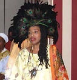
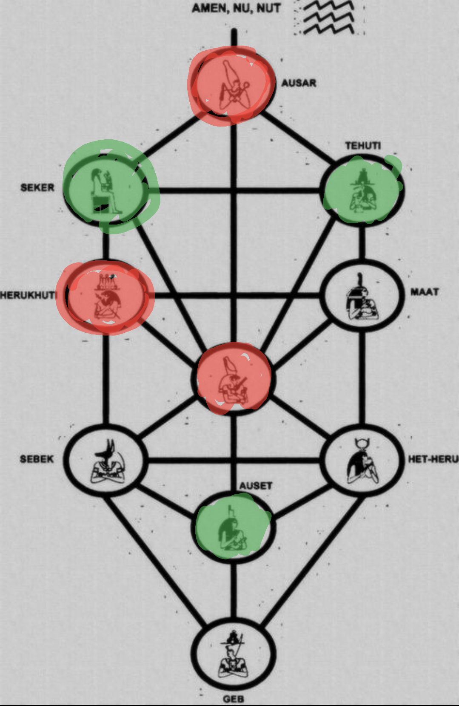

<!doctype html>
<html lang="en">
<head>
  <meta charset="utf-8" />
  <meta name="viewport" content="width=device-width,initial-scale=1" />
  <title>SwamiG Institute — Extending Royal Legacy</title>
  <meta name="description" content="Anke–Karade lineage, mentors, and Tree of Life context — SwamiG Institute." />
  <link rel="preconnect" href="https://fonts.googleapis.com">
  <link rel="preconnect" href="https://fonts.gstatic.com" crossorigin>
  <link href="https://fonts.googleapis.com/css2?family=Inter:wght@300;400;600;800&family=Crimson+Text:wght@400;700&display=swap" rel="stylesheet">
  
</head>
<body>
  

    <!-- Header -->
    <header class="header">
      <h1 class="title">SwamiG Institute</h1>
      
“Extending Royal Legacy”

      
“…many paths 1 truth…” | “…we seek no followers…”

    </header>

    <!-- Lineage -->
    <section class="section">
      <h2>Anke–Karade Lineage</h2>
      

        

          <ul>
            <li>Awise Wande Abimbola & Iya Besie Abimbola (Nigeria)</li>
            <li>Iya Omoladun Anke (Nigeria)</li>
            <li>Baba Ogunyeye Akangbe (Nigeria)</li>
            <li>Iya Osunnike Anke (US)</li>
            <li>Baba Koleoso Karade (US)</li>
            <li>Awo Fasuuruate Anke-Karade (US)</li>
            <li>“SwamiG” (US)</li>
          </ul>
        

        

          
          
          
        

      

    </section>

    <!-- Diagram -->
    <section class="section">
      <h2>Khamitic Tree of Life</h2>
      

        
      

    </section>

    <!-- Footer -->
    <footer class="footer">
      
SwamiG Institute — <a href="http://swamiginstitute.com/">SwamiGInstitute.com</a> | 
         <a href="https://www.manypaths1truth.org/">ManyPaths1Truth.org</a>

    </footer>
  

</body>
</html>
